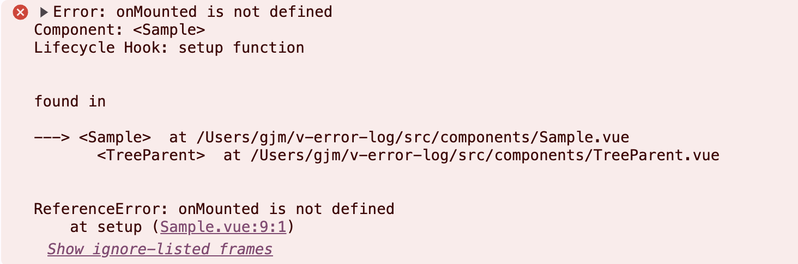

# v-error-log

> example

```js
// main.js


import { createApp } from 'vue'
import './style.css'
import App from './App.vue'

import { attachErrorInterceptor } from './helpers/config';


const app = createApp(App);


const errorHandler = (errorMessage: string) => {
  console.log(errorMessage);
  console.log('----------------------------------------------');
}

attachErrorInterceptor(app, errorHandler); // this!


app.mount('#app')


```

<br/>

> console example

